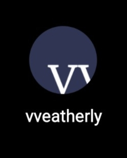
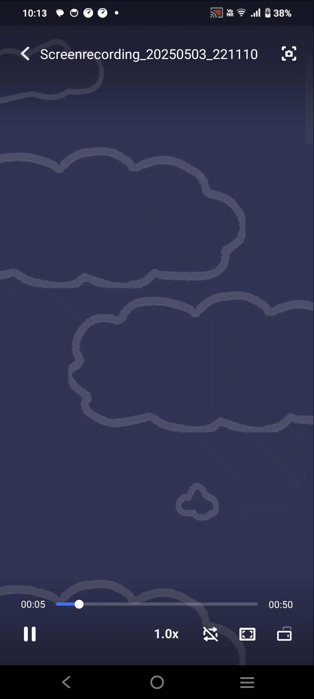
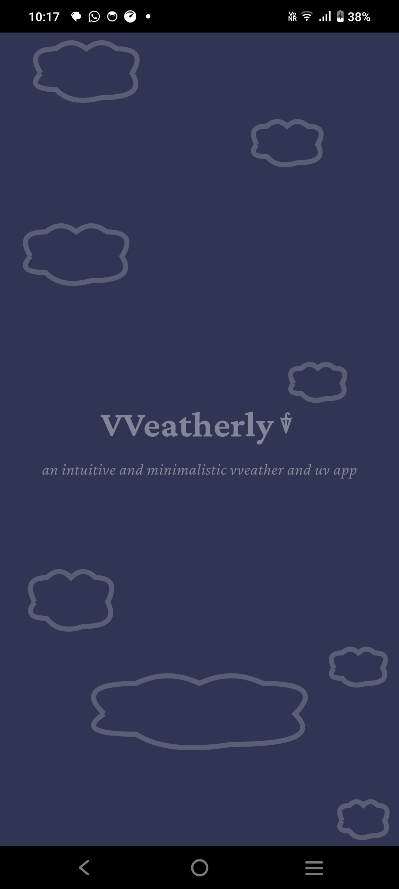
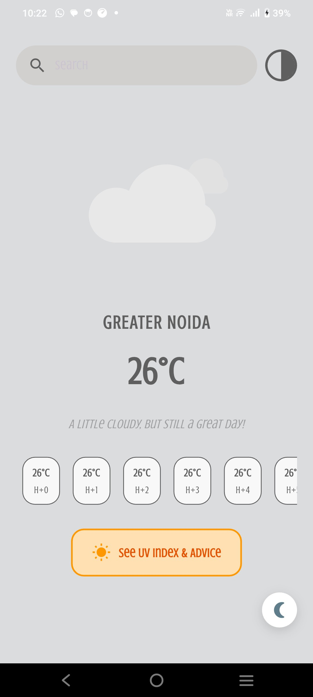
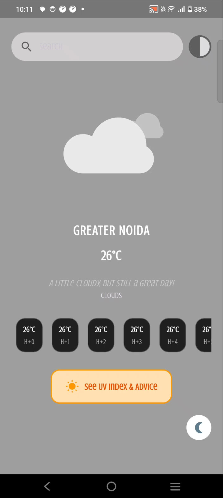
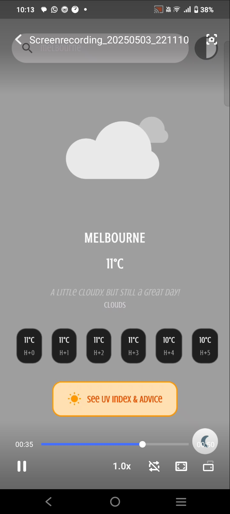
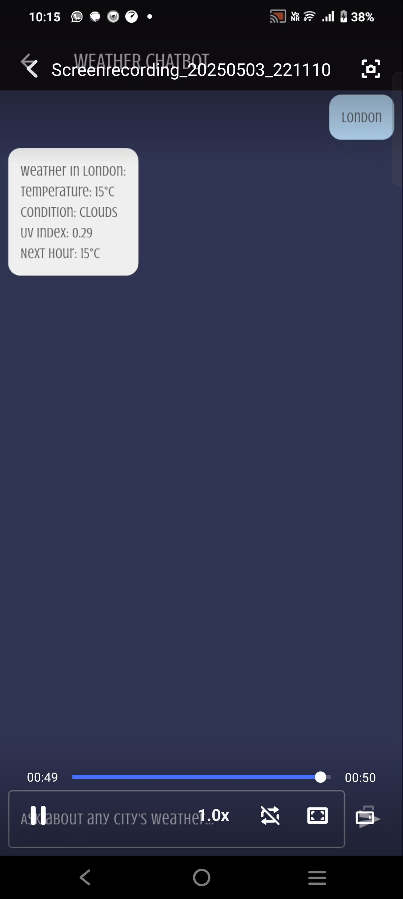
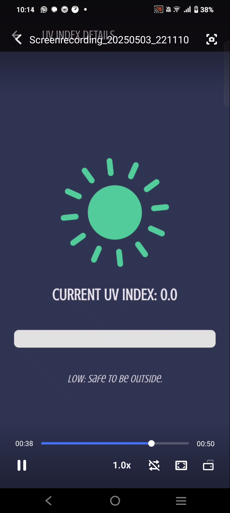

# VVeatherly App
<p>
VVeatherly is a simple, minimilistic and aesthetic cross-platform Flutter weather application that provides real-time weather information, UV index, and a chatbot interface for weather queries. The app uses the OpenWeatherMap One Call 3.0 API and supports both light and dark themes. 
This app was originally a figma idea that was then brought to life using flutter. 
</p>

## demo version
<video controls src="demo.mp4" title="Title"></video>
The actual screenshots of the android version of the app are as follows: 











---

## Features

- **Current Weather:**  
  View temperature, weather conditions, and hourly forecasts for any city.

- **UV Index Module:**  
  Get the current UV index and safety advice for your location.

- **Weather Chatbot:**  
  Ask about the weather in any city using a simple chat interface.

- **Theme Toggle:**  
  Switch between light and dark temperature screens.

- **Animated UI:**  
  Enjoy Lottie animations for different weather conditions.

- **Background Audio:**  
  Ambient background music on the splash screen (with platform support).

---

## Getting Started

### 1. Clone the repository

```sh
git clone https://github.com/yourusername/weather_app.git
cd weather_app/weather_app